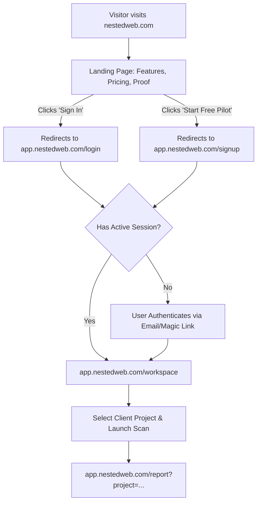

# Two-Server Deployment Architecture: Landing Page vs. SaaS Application

This document defines the architectural blueprint for separating the **Marketing Landing Page** and the **AI Visibility OS SaaS Application** onto two distinct servers and domains.

---

## 1. Domain & URL Hierarchy

| Subsystem                  | Primary URL                 | Alternative / Redirect                  | Host Environment                                                        | Purpose                                                                                 |
| :------------------------- | :-------------------------- | :-------------------------------------- | :---------------------------------------------------------------------- | :-------------------------------------------------------------------------------------- |
| **Marketing Landing Site** | `https://nestedweb.com`     | `https://www.nestedweb.com`             | Edge Static CDN (Cloudflare Pages, Vercel, Netlify)                     | Brand awareness, product features, pricing, agency proof, lead conversion               |
| **SaaS Application**       | `https://app.nestedweb.com` | `https://saas.nestedweb.com` (optional) | Next.js App Router (Node.js runtime on Vercel / Railway / Fly.io / VPS) | User authentication, agency workspace, project management, live scans, evidence reports |

---

## 2. Why Decouple Landing from SaaS?

1. **Security Boundary & Secret Isolation**:
   - The marketing landing page contains zero environment secrets, zero API keys, and no database credentials.
   - Even in the event of high public traffic or crawler attacks on the landing page, the SaaS backend and Supabase database remain completely isolated.
2. **Performance & Global Edge Delivery**:
   - The landing page is pure static HTML/CSS/JS with instantaneous global Time-To-First-Byte (< 50ms TTFB via Edge CDNs).
   - Marketing campaigns (Product Hunt, Twitter/X, SEO, PPC) do not consume compute or memory on the SaaS server.
3. **Independent Release Lifecycles**:
   - Marketing copy, screenshots, customer testimonials, and pricing announcements can be updated and redeployed in seconds without triggering SaaS regression test suites or database migrations.
4. **Focused Application Gateway**:
   - The SaaS domain (`app.nestedweb.com`) focuses exclusively on application concerns: authentication, tenant onboarding, scans, and client reports.

---

## 3. Directory Layout in Repository

```
NestedWeb/
├── landing/                          # Standalone Marketing Landing Site
│   ├── index.html                   # High-converting responsive landing page
│   ├── assets/                      # Brand assets, screenshots, icons
│   └── README.md                    # Deployment guide for Cloudflare / Netlify / Vercel
├── src/                              # SaaS Application (Next.js App Router)
│   ├── app/
│   │   ├── page.tsx                 # SaaS Entry / Auth Gateway (Sign in / Register)
│   │   ├── login/                   # Dedicated Login page
│   │   ├── workspace/               # Agency Workspace Dashboard
│   │   ├── report/                  # Client Visibility & Evidence Report
│   │   └── api/health/              # Production Health Check Probe
│   ├── domain/                      # Pure business logic (metrics, quotas, actions)
│   ├── application/                 # Orchestration services
│   └── infrastructure/              # Supabase, Gemini adapters (server-only)
└── .ai-context/
    ├── deployment-architecture.md   # This document
    ├── project-checklist.md
    └── task-history.md
```

---

## 4. User Journey & Navigation Flow



---

## 5. DNS & Network Configuration

When configuring your domain DNS provider (e.g. Cloudflare, Namecheap, Route53, GoDaddy):

### For the Marketing Landing Page (`nestedweb.com`)

- **Apex Domain (`nestedweb.com`)**:
  - `A` Record / `ALIAS` / `CNAME flattening` pointing to the Edge host (e.g., `192.0.2.1` or Cloudflare Pages project).
- **Subdomain `www` (`www.nestedweb.com`)**:
  - `CNAME` pointing to `nestedweb.com` (with redirect rule) or to the Edge host.

### For the SaaS Application (`app.nestedweb.com`)

- **Subdomain `app` (`app.nestedweb.com`)**:
  - `CNAME` pointing to your Next.js application host (e.g., `cname.vercel-dns.com` or Railway/Fly app domain).

---

## 6. Authentication & Session Cookies

- **Supabase Auth**:
  - Set `Site URL` in Supabase Auth Settings to: `https://app.nestedweb.com`.
  - Set `Additional Redirect URLs` to include: `https://app.nestedweb.com/*` and local dev `http://localhost:3000/*`.
  - Cookies set by `@supabase/ssr` on `app.nestedweb.com` have `SameSite=Lax` and `Secure=true`, isolated to the `app` subdomain.
